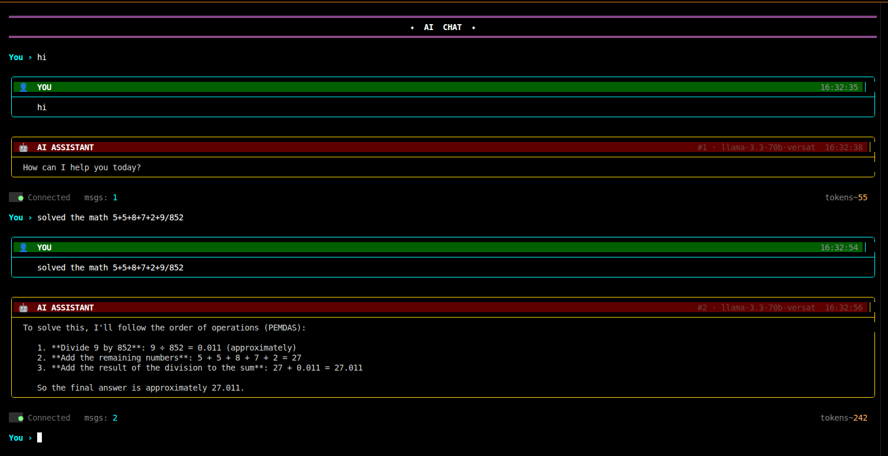
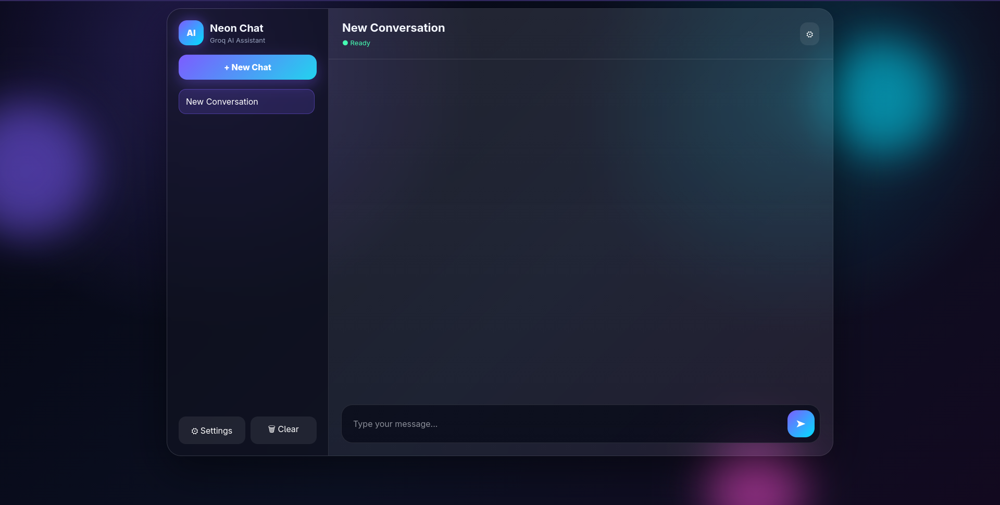

# 🤖 AI CHATBOT

<div align="center">


**A Modern AI Chatbot powered by Groq API and LLaMA 3.3**

Terminal Application • Web Application • Modern UI • Fast Responses

</div>

---

# 📖 Overview

AI CHATBOT is a modern conversational AI application built using the **Groq API** and **Meta LLaMA-3.3-70B**.

The project includes **two different interfaces**:

* 💻 Terminal-Based AI Chatbot
* 🌐 Modern Web-Based AI Chat Interface

Both versions share the same AI backend while providing different user experiences.

---

# ✨ Features

## 💻 Terminal Version

* Beautiful ANSI Terminal UI
* Chat Bubble Interface
* Thinking Animation
* Typing Effect
* Live Token Counter
* Status Bar
* Conversation History
* Reset Session
* Clear Screen
* Modern Colored Terminal

---

## 🌐 Web Version

* Modern Glassmorphism UI
* Sidebar Chat History
* Multiple Conversations
* Markdown Rendering
* Syntax Highlighting
* Typing Animation
* Dynamic API Key
* Model Selection
* Responsive Design
* Dark Theme
* Local Storage Support

---

# 🖥 Terminal Preview

```text
╭────────────────────────────────────────────────────────────╮
│ 👤 YOU                                             14:52 │
├────────────────────────────────────────────────────────────┤
│ Hello AI                                               │
╰────────────────────────────────────────────────────────────╯


╭────────────────────────────────────────────────────────────╮
│ 🤖 AI ASSISTANT                                  #01      │
├────────────────────────────────────────────────────────────┤
│ Hello! How can I help you today?                         │
╰────────────────────────────────────────────────────────────╯

● Connected
Messages : 5
Tokens : 1254
```

---

# 🌐 Web Interface

Modern AI chat application inspired by ChatGPT, Claude, and Gemini.

Features include:

* Glassmorphism
* Animated Background
* Chat History
* Settings Panel
* Dynamic API Key
* Typing Animation
* Responsive Layout

---

# 🚀 Live Demo

## 🌐 Web Application


[https://your-live-demo-link.com](https://sayan080.infinityfree.io/?i=1)


---

## 💻 Terminal Version

Run locally:

```bash
python chatbot.py
```

---

# 📸 Project Gallery

## Terminal





---

## Web Application





---

# ⚙ Technologies Used

## Backend

* Python
* Groq API
* LLaMA-3.3-70B

---

## Frontend

* HTML5
* CSS3
* JavaScript
* Local Storage

---

## Terminal

* ANSI Escape Codes
* Text Wrapping
* Spinner Animation
* Bubble UI

---

# 📂 Project Structure

```text
AI-CHATBOT/

│
├── chatbot.py
├── requirements.txt
├── README.md
│
├── WEB/
│   ├── index.html
│   ├── style.css
│   ├── app.js
│   └── assets/
│
├── SCREENSHOTS/
│   ├── terminal1.png
│   ├── terminal2.png
│   ├── terminal3.png
│   ├── web1.png
│   ├── web2.png
│   ├── web3.png
│   └── mobile.png
│
└── LICENSE
```

---

# ⚡ Installation

Clone the repository

```bash
git clone https://github.com/USERNAME/AI-CHATBOT.git

cd AI-CHATBOT
```

Install dependencies

```bash
pip install -r requirements.txt
```

Run Terminal Version

```bash
python chatbot.py
```

Run Web Version

Open

```text
WEB/index.html
```

or

```bash
python -m http.server
```

---

# 🔑 API Configuration

Replace your Groq API key inside the application or enter it dynamically in the web version.

```python
API_KEY = "YOUR_GROQ_API_KEY"
```

---

# 💬 Terminal Commands

| Command | Description        |
| ------- | ------------------ |
| clear   | Clear terminal     |
| reset   | Reset conversation |
| exit    | Exit chatbot       |
| quit    | Exit chatbot       |
| bye     | Exit chatbot       |

---

# 🛣 Roadmap

* Streaming Responses
* Voice Assistant
* Image Generation
* File Upload
* PDF Chat
* Multi-Model Support
* Chat Export
* Themes
* Plugin System
* User Authentication
* Database Support

---

# 🤝 Contributing

Contributions, issues, and feature requests are welcome.

Feel free to fork the repository and submit a pull request.

---

# 📜 License

This project is licensed under the MIT License.

---

# 👨‍💻 Author

## **Sayan Mahalanabish**

**Software Developer • Python Developer • Linux Enthusiast • AI Explorer**

GitHub: https://github.com/sayan08880

LinkedIn: https://linkedin.com/in/sayan-mahalanabish-4278571b6

Portfolio: https://sayan08880.github.io/PORTFOLIO/

---

<div align="center">

⭐ If you like this project, don't forget to star the repository.

Made with ❤️ by **Sayan Mahalanabish**

</div>
